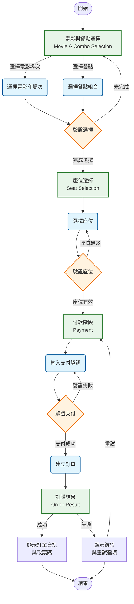

## 電影購票系統規劃文件

### 1. Requirement (需求)

本文件聚焦於電影購票系統前端的四大核心流程設計。

*   **1.1 電影與餐點 (Movie & Combo Selection)**
    *   **核心功能**:
        *   顯示可供選擇的電影列表，包含影片名稱、影城、場次等資訊。
        *   允許用戶選擇特定電影的場次、電影票種與數量。
        *   顯示訂單內容，包含餐點名稱、圖片、價格等資訊。
        *   提供返回首頁或上一步的導航。
        *   提供進入下一步（座位選擇）的按鈕，並在選擇完成後啟用。
*   **1.2 座位 (Seat Selection)**
    *   **核心功能**:
        *   顯示所選電影場次的影廳座位圖。
        *   區分`已售出`、`未售出`和已選座位（`您的座位`）。
        *   允許用戶自由選擇一個或多個可用座位，並可隨時變更選擇。
        *   動態更新已選座位的座位代號（如：E8）及選擇的座位數量。
        *   提供返回上一步（電影與餐點）的導航。
        *   提供進入下一步（付款）的按鈕，並在選擇座位後啟用。
*   **1.3 付款 (Payment)**
    *   **核心功能**:
        *   顯示訂單摘要，包含電影資訊、場次、座位、餐點、總金額等。
        *   允許用戶輸入信用卡支付資訊（例如：信用卡號、有效期限、安全碼）。
        *   實作支付資訊的驗證。
        *   提供返回上一步（座位）的導航。
        *   提供確認付款的按鈕，並在支付資訊有效後啟用。
*   **1.4 訂購結果 (Order Result)**
    *   **核心功能**:
        *   顯示訂單處理結果（成功或失敗）。
        *   如果成功，顯示訂單號、取票碼、電影資訊、座位、餐點等詳細資訊。
        *   如果失敗，顯示失敗原因並提供重試或返回的選項。
        *   提供返回首頁或查看訂單歷史的選項。

### 2. Route Design (路由設計)

本系統將採用前端路由，並為每個購票流程階段設計清晰的路由名稱和路徑。

*   **2.1 Name & Path (名稱與路徑)**

| 階段             | 路由名稱 (Name)      | 路徑 (Path)                  |
| :--------------- | :------------------- | :--------------------------- |
| 電影與餐點       | `booking-movie-combo` | `/booking/movie-combo`       |
| 座位             | `booking-seat`        | `/booking/seat`              |
| 付款             | `booking-payment`     | `/booking/payment`           |
| 訂購結果         | `booking-result`      | `/booking/result/:orderId?` |

*   **2.2 Page Permissions (頁面權限)**
    *   **邏輯**: 購票流程的頁面需要依序訪問，防止用戶跳過步驟。
        *   `booking-seat` 頁面需要從 `booking-movie-combo` 頁面導航過來，並攜帶有效的電影場次和餐點選擇資訊。
        *   `booking-payment` 頁面需要從 `booking-seat` 頁面導航過來，並攜帶有效的座位選擇資訊。
        *   `booking-result` 頁面需要從 `booking-payment` 頁面導航過來，並攜帶訂單處理結果。
    *   **實作方式**:
        *   使用導航守衛 (Navigation Guards)，例如 Vue Router 的 `beforeEach` 或 `beforeEnter`。
        *   在進入每個階段頁面時，檢查 Pinia Store 中是否存在前一階段的必要資料。如果資料不完整，則重定向回前一階段或購票流程的起點。
        *   `booking-result` 頁面在訂單成功時，可以透過路由參數 (`:orderId`) 傳遞訂單 ID，以便顯示詳細資訊。

### 3. API (應用程式介面)

針對購票流程中可能需要的後端 API 進行設計。

*   **3.1 取得電影場次與餐點資訊**
    *   **端點**: `/api/movies/showtimes`
    *   **方法**: `GET`
    *   **請求參數**:
        *   `date` (Optional): 日期，格式 YYYY-MM-DD，用於篩選特定日期的場次。
    *   **響應格式**:
        ```json
        {
            "code": 200,
            "message": "Success",
            "data": {
                "movies": [
                    {
                        "id": "movie001",
                        "title": "電影名稱 A",
                        "posterUrl": "/images/poster_a.jpg",
                        "showtimes": [
                            {
                                "showtimeId": "st001",
                                "theater": "影廳 1",
                                "time": "14:00",
                                "price": 280,
                                "availableSeats": 50
                            }
                        ]
                    }
                ],
                "combos": [
                    {
                        "comboId": "combo001",
                        "name": "爆米花套餐",
                        "description": "大爆米花 + 中杯可樂",
                        "price": 150,
                        "imageUrl": "/images/combo_popcorn.jpg"
                    }
                ]
            }
        }
        ```
*   **3.2 取得座位圖資訊**
    *   **端點**: `/api/showtimes/{showtimeId}/seats`
    *   **方法**: `GET`
    *   **請求參數**:
        *   `showtimeId` (Path Parameter): 場次 ID。
    *   **響應格式**:
        ```json
        {
            "code": 200,
            "message": "Success",
            "data": {
                "theaterName": "影廳 1",
                "rows": 10,
                "cols": 15,
                "seats": [
                    { "row": "A", "col": 1, "status": "available" },
                    { "row": "A", "col": 2, "status": "occupied" }
                    // ...
                ]
            }
        }
        ```
*   **3.3 建立訂單 (預訂座位與餐點)**
    *   **端點**: `/api/orders`
    *   **方法**: `POST`
    *   **請求參數**:
        ```json
        {
            "showtimeId": "st001",
            "selectedSeats": [
                { "row": "A", "col": 3 },
                { "row": "A", "col": 4 }
            ],
            "selectedCombos": [
                { "comboId": "combo001", "quantity": 1 }
            ],
            "totalAmount": 610
        }
        ```
    *   **響應格式**:
        ```json
        {
            "code": 200,
            "message": "Order created successfully",
            "data": {
                "orderId": "ORD202406040001",
                "paymentRequired": true,
                "paymentUrl": "https://payment-gateway.com/pay?orderId=ORD202406040001" // 如果需要導向支付頁面
            }
        }
        ```
*   **3.4 執行付款**
    *   **端點**: `/api/payments`
    *   **方法**: `POST`
    *   **請求參數**:
        ```json
        {
            "orderId": "ORD202406040001",
            "paymentDetails": {
                "cardNumber": "xxxx-xxxx-xxxx-xxxx",
                "expiryDate": "MM/YY",
                "cvv": "xxx"
            }
        }
        ```
    *   **響應格式**:
        ```json
        {
            "code": 200,
            "message": "Payment successful",
            "data": {
                "orderId": "ORD202406040001",
                "status": "paid",
                "ticketCode": "ABCDEF123456"
            }
        }
        ```
        或
        ```json
        {
            "code": 400,
            "message": "Payment failed",
            "error": "Insufficient funds"
        }
        ```
*   **3.5 取得訂單詳情**
    *   **端點**: `/api/orders/{orderId}`
    *   **方法**: `GET`
    *   **請求參數**:
        *   `orderId` (Path Parameter): 訂單 ID。
    *   **響應格式**:
        ```json
        {
            "code": 200,
            "message": "Success",
            "data": {
                "orderId": "ORD202406040001",
                "status": "paid",
                "movieTitle": "電影名稱 A",
                "showtime": "2024-06-04 14:00 影廳 1",
                "selectedSeats": ["A3", "A4"],
                "selectedCombos": [
                    { "name": "爆米花套餐", "quantity": 1, "price": 150 }
                ],
                "totalAmount": 610,
                "ticketCode": "ABCDEF123456"
            }
        }
        ```

### 4. Components (組件)

識別並設計購票流程中主要的 UI 組件。

*   **4.1 頁面級組件 (Page Components)**
    *   **`MovieComboSelection.vue`**:
        *   **職責**: 負責電影場次和餐點選擇的整體佈局和邏輯。
        *   **子組件**: `MovieList`, `ComboList`, `BookingSummary`。
    *   **`SeatSelection.vue`**:
        *   **職責**: 負責座位選擇的整體佈局和邏輯。
        *   **子組件**: `TheaterSeatingChart`, `BookingSummary`。
    *   **`Payment.vue`**:
        *   **職責**: 負責支付資訊輸入與付款流程的整體佈局和邏輯（支付方式僅支援信用卡）。
        *   **子組件**: `PaymentForm`, `BookingSummary`。
    *   **`OrderResult.vue`**:
        *   **職責**: 負責顯示訂單結果和詳細資訊。
        *   **子組件**: `OrderDetails`。

*   **4.2 可重用組件 (Reusable Components)**
    *   **`MovieList.vue`**:
        *   **職責**: 顯示電影列表，允許用戶選擇電影和場次。
        *   **屬性**: `movies` (Array of Object), `selectedMovieId` (String), `selectedShowtimeId` (String)。
        *   **事件**: `select-showtime` (showtimeId)。
    *   **`ComboList.vue`**:
        *   **職責**: 顯示餐點列表，允許用戶選擇餐點數量。
        *   **屬性**: `combos` (Array of Object), `selectedCombos` (Array of Object)。
        *   **事件**: `update-combo-quantity` (comboId, quantity)。
    *   **`TheaterSeatingChart.vue`**:
        *   **職責**: 顯示影廳座位圖，處理座位選擇邏輯。
        *   **屬性**: `seats` (Array of Object), `selectedSeats` (Array of Object)。
        *   **事件**: `toggle-seat` (seatInfo)。
    *   **`BookingSummary.vue`**:
        *   **職責**: 顯示當前購票流程的摘要資訊（電影、場次、座位、餐點、總價）。
        *   **屬性**: `movieInfo` (Object), `selectedSeats` (Array), `selectedCombos` (Array), `totalAmount` (Number)。
    *   **`PaymentForm.vue`**:
        *   **職責**: 提供支付資訊輸入表單 (支付方式固定為信用卡)。
        *   **事件**: `submit-payment` (paymentDetails)。
    *   **`OrderDetails.vue`**:
        *   **職責**: 顯示訂單的詳細資訊。
        *   **屬性**: `order` (Object)。
    *   **`NavigationButtons.vue`**:
        *   **職責**: 提供「上一步」和「下一步」的導航按鈕。
        *   **屬性**: `prevRouteName` (String), `nextRouteName` (String), `nextButtonDisabled` (Boolean)。
        *   **事件**: `navigate-prev`, `navigate-next`。

### 5. Data Transfer Methods (資料傳遞方式)

在不同組件或頁面之間傳遞資料的方式。

*   **5.1 Pinia (狀態管理)**
    *   **用途**: 用於管理跨頁面或跨組件的全局狀態，特別是購票流程中的核心資料。
    *   **儲存內容**:
        *   `selectedMovie`: 包含電影 ID、場次 ID、電影名稱、場次時間、影廳等。
        *   `selectedCombos`: 包含已選餐點的 ID 和數量。
        *   `selectedSeats`: 包含已選座位的行和列資訊。
        *   `orderId`: 訂單建立後返回的訂單 ID。
        *   `paymentStatus`: 支付狀態。
        *   `ticketCode`: 訂單成功後的取票碼。
    *   **優勢**: 集中管理狀態，方便追蹤和調試，避免 Props Drilling。
*   **5.2 Props / Emits (父子組件通訊)**
    *   **用途**: 用於父組件向子組件傳遞資料 (Props)，以及子組件向父組件發送事件 (Emits)。
    *   **範例**:
        *   `MovieComboSelection.vue` 將 `movies` 和 `combos` 資料作為 Props 傳遞給 `MovieList.vue` 和 `ComboList.vue`。
        *   `MovieList.vue` 在用戶選擇場次後，通過 Emit 事件將 `showtimeId` 傳遞給 `MovieComboSelection.vue`。
        *   `TheaterSeatingChart.vue` 通過 Emit 事件將 `selectedSeats` 的變化通知給 `SeatSelection.vue`。
*   **5.3 Vue Router Params / Query (路由參數)**
    *   **用途**: 用於在頁面跳轉時傳遞少量、非敏感的資料，或用於標識特定資源。
    *   **範例**:
        *   在 `booking-result` 頁面，可以通過路由參數 `orderId` (`/booking/result/:orderId`) 來獲取訂單 ID，然後再調用 API 獲取訂單詳情。
        *   在 `booking-movie-combo` 頁面，可以通過 Query 參數 (`/booking/movie-combo?date=2024-06-04`) 來篩選特定日期的電影場次。
*   **5.4 Local Storage / Session Storage (本地儲存)**
    *   **用途**: 用於儲存少量、非敏感、需要持久化的資料，例如用戶偏好、臨時的購票草稿（如果流程中斷需要恢復）。
    *   **注意**: 購票流程的核心敏感資料不應直接儲存在此，應以 Pinia 為主，並在必要時與後端同步。

---

### 流程圖 (Mermaid Diagram)


